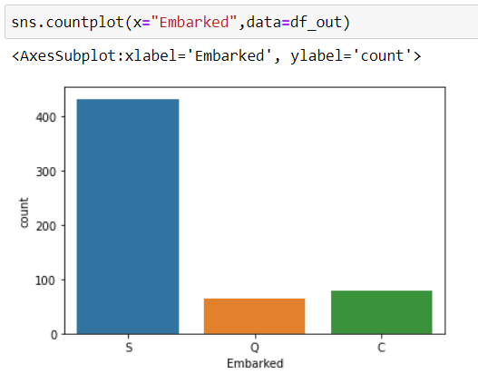
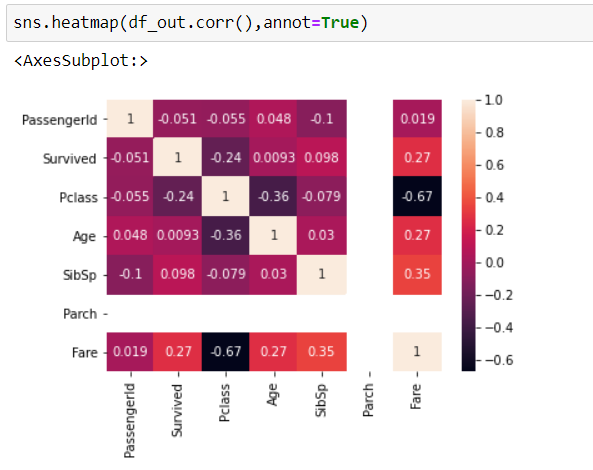

# Ex-03EDA

## AIM
To perform EDA on the given data set. 

## Explanation
The primary aim with exploratory analysis is to examine the data for distribution, outliers and anomalies to direct specific testing of your hypothesis.
Exploratory Data Analysis (EDA) is an approach to analyze the data using visual techniques. It is used to discover trends, patterns, or to check assumptions with the help of statistical summary and graphical representations. 

## ALGORITHM
### STEP 1
Import the required packages.
### STEP 2
Read the csv file and convert into DataFrame.
### STEP 3
Perform Data Cleaning on the DataSet.
### STEP 4
Detect and Remove the Outliers from the Dataset.
### STEP 5
Perform Exploratory Data Analysis on the data.

## CODE
```
import pandas as pd
import numpy as np
import seaborn as sns

df=pd.read_csv("titanic_dataset.csv")
df.info()
df.head()
df.isnull().sum()

df.drop("Cabin",axis=1,inplace=True)
df.info()
df.isnull().sum()

df["Age"]=df["Age"].fillna(df["Age"].median())
df.boxplot()
df.isnull().sum()

df["Embarked"]=df["Embarked"].fillna(df["Embarked"].mode()[0])
df.isnull().sum()
df.boxplot()

Q1 = df.quantile(0.25)
Q3 = df.quantile(0.75)
IQR = Q3 - Q1
print(IQR)
df_out = df[~((df < (Q1 - 1.5 * IQR)) |(df > (Q3 + 1.5 * IQR))).any(axis=1)]
print(df_out.shape)
df_out.boxplot()
df_out.info()

df["Embarked"].value_counts()
df_out["Embarked"].value_counts()
df["Pclass"].value_counts()
df_out["Pclass"].value_counts()
df["Survived"].value_counts()
df_out["Survived"].value_counts()
df["Sex"].value_counts()
df_out["Sex"].value_counts()
df["SibSp"].value_counts()
df_out["SibSp"].value_counts()

sns.countplot(x="Survived",data=df_out)
sns.countplot(x="Pclass",data=df_out)
sns.countplot(x="Sex",data=df_out)
sns.countplot(x="Embarked",data=df_out)
sns.countplot(x="SibSp",data=df_out)

df_out.info()
sns.displot(df_out["Fare"])
sns.displot(df_out["Age"])

sns.countplot(x="Pclass",hue="Survived",data=df_out)
sns.countplot(x="Sex",hue="Survived",data=df_out)
sns.countplot(x="SibSp",hue="Sex",data=df_out)
sns.countplot(x="Embarked",hue="Pclass",data=df_out)
sns.countplot(x="Survived",hue="Embarked",data=df_out)

sns.displot(df_out[df_out["Survived"]==0]["Age"])
sns.displot(df_out[df_out["Survived"]==1]["Age"])
sns.displot(df_out[df_out["SibSp"]==0]["Embarked"])
sns.displot(df_out[df_out["SibSp"]==1]["Embarked"])

pd.crosstab(df_out["Pclass"],df_out["Survived"])
pd.crosstab(df_out["Sex"],df_out["Survived"])
pd.crosstab(df_out["Pclass"],df_out["Sex"])
pd.crosstab(df_out["Sex"],df_out["Embarked"])

df.corr()
df_out.corr()
sns.heatmap(df.corr(),annot=True)
sns.heatmap(df_out.corr(),annot=True)
```
## OUPUT
### Number of Rows and Columns in the DataFrame:

### Initial DataFrame:

### Sum of null data value present in each column:

### Droping "Cabin" column from DataFrame:

### Sum of null data value-After removing "Cabin" from DataFrame:

### Handling Null data - Column "Age":

### Handling Null data - Column "Embarked":

### Graphical Representation - Before removing Outliers:

### Statistical Method (IQR) to remove Outliers from Dataset:

### Graphical Representation - After removing Outliers:

### Infromation on Number of rows and columns are removing Ouliers:

## EDA 
### Statistical Method of Analyzation:
```
df - DataFrame before handling missing data and removing Outliers.

df_out - DataFrame after handling missing data and removing outliers.
```
#### Insight about data in Column -Embarked:

#### Insight about data in Column -Pclass:

#### Insight about data in Column -Survived:

#### Insight about data in Column -Sex:

#### Insight about data in Column -SibSp:


### Graphical Method of Analyzation:

#### Analyzation of Column - Survived:

#### Analyzation of Column - Sex:

#### Analyzation of Column - Pclass:

#### Analyzation of Column - Embarked:

#### Analyzation of Column - SibSp:


### Non Categorical Data- Distributive Plot:
#### Column-Fare:

#### Column-Age:

#### Comparing Column "Survived" with Column "Age":


#### Comparing Column "SibSp" with Column "Embarked":


### Categorical Data - Bivariate Graphical:

#### Comparing Columns "Pclass" and "Survived":

#### Comparing Columns "Sex" and "Survived":

#### Comparing Columns "SibSp" and "Sex":

#### Comparing Columns "Embarked" and "Pclass":

#### Comparing Columns "Survived" and "Embarked":


### Statistical Method - Cross tabulation:

#### Cross Tab of "Pclass" and "Survived":

#### Cross Tab of "Sex" and "Survived":

#### Cross Tab of "Pclass" and "Sex":

#### Cross Tab of "Sex" and "Embarked":


### Correlation of columns:

#### Correlation of columns in Initial DataFrame(Before removing Outliers): 

#### Graphical Representation to view correlation:

#### Correlation of columns in Final DataFrame(After removing Outliers): 

#### Graphical Representation to view correlation:


## Result:
Data cleaning and Outlier removal has been carried out in the given DataFrame.EDA is sucessfully performed in the given dataset.
